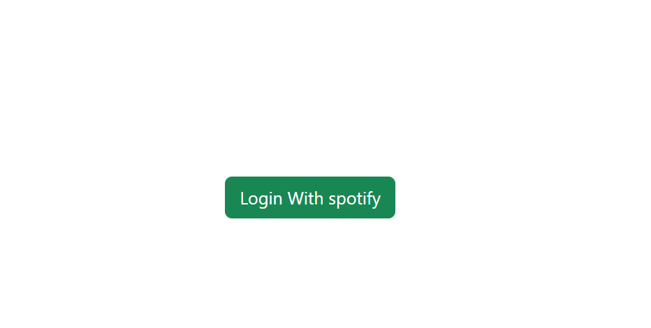
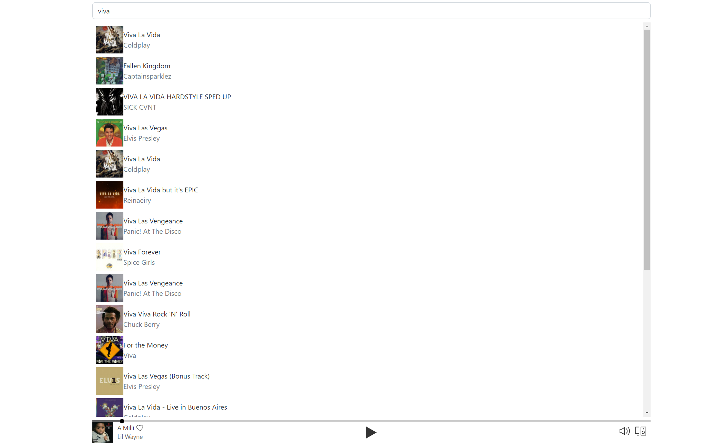
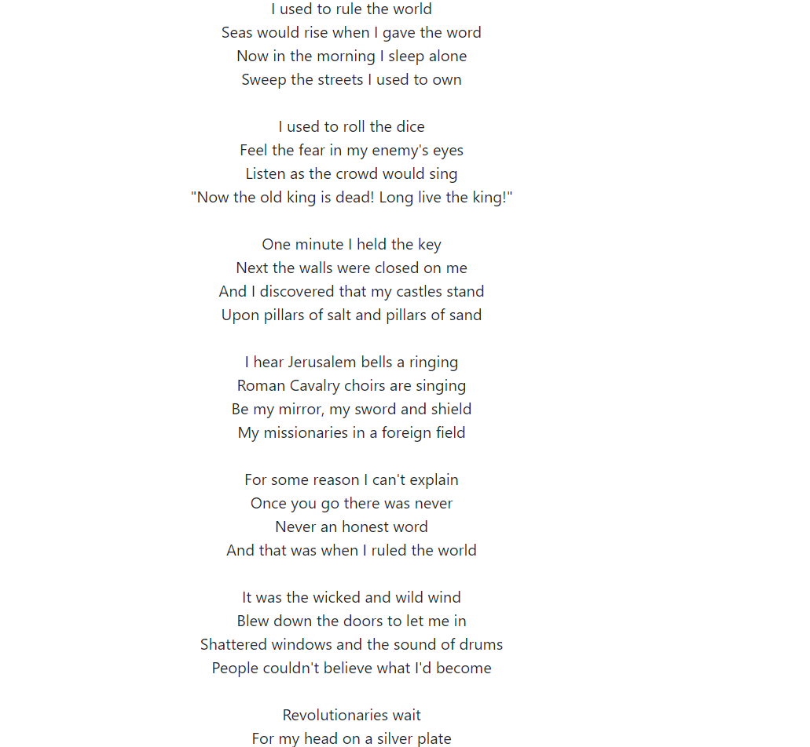

# react mini spotify

I built out this simple spotify-clone project that uses the spotify api for auth. It displays the lyrics of the song, has a music player, and has song search functionality 

